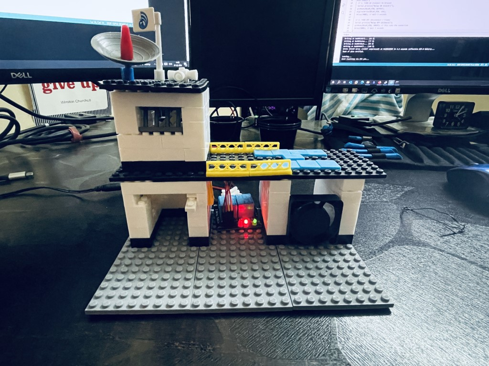
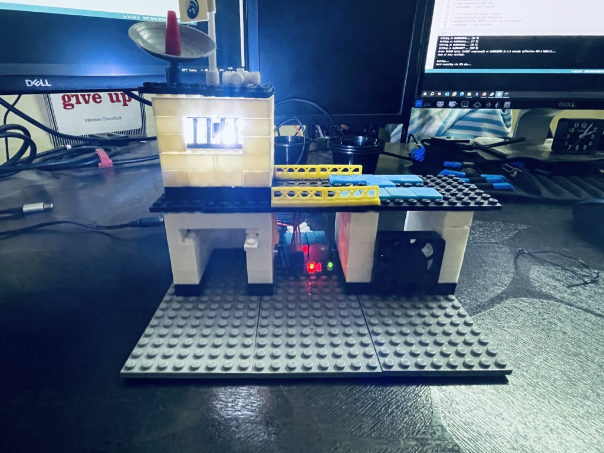
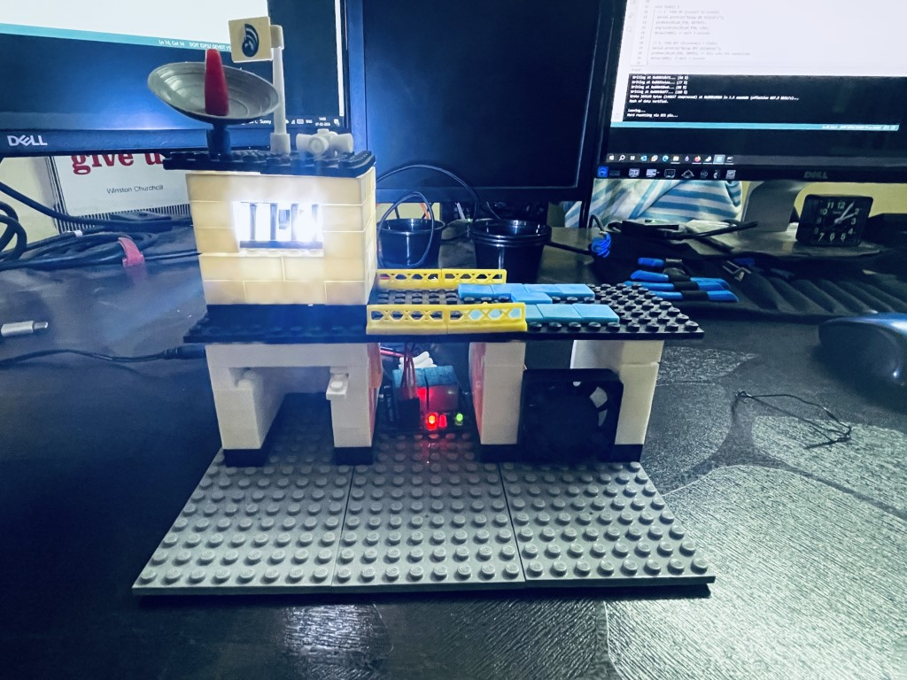

# Lego-Automation-Smart-Building
My son asked a simple question while playing: "Dad, can we make this Lego building actually do something?" Challenge accepted.

Instead of just adding a battery-operated light, I decided to build real automation into it. I hooked a microcontroller to operate components, allowing the entire "building" to be controlled wirelessly from a laptop, giving it that true Smart building feeling.

It was a fantastic weekend project that combined creativity with a bit of engineering.

Here's the final result.

**Lights and Fan ON** 
**Only Fan ON** 
**Only Lights ON** 
**Lights and Fan OFF** 

**Video**

